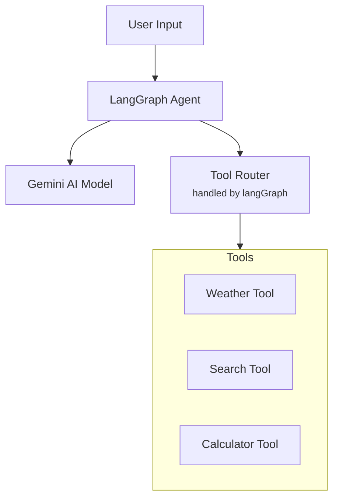

# ai-orchestration-agent
A tool-based AI agent built using LangGraph and Google Gemini models. This project demonstrates how to orchestrate multiple tools with a Gemini-powered agent, enabling structured decision-making, natural language reasoning, and seamless integration with external APIs.
# 🤖 LangGraph Gemini AI Agent

A powerful conversational AI agent built with LangGraph and Google's Gemini AI, featuring intelligent tool usage, conversation memory, and comprehensive testing suite.

## ✨ Features

- **🧠 Intelligent Conversation**: Powered by Google Gemini 2.0 Flash
- **🌤️ Weather Integration**: Real-time weather data retrieval
- **💾 Memory Management**: Persistent conversation context
- **🔧 Smart Tool Usage**: Automatically determines when to use tools vs. general knowledge
- **⚡ Performance Optimized**: Sub-second response times
- **🧪 Comprehensive Testing**: 21 test scenarios covering all functionality
- **🛡️ Error Handling**: Graceful handling of edge cases and API limits

## 🏗️ Architecture

```
┌─────────────────┐    ┌──────────────────┐    ┌─────────────────┐
│   User Input    │───▶│  LangGraph Agent │───▶│ Gemini AI Model │
└─────────────────┘    └──────────────────┘    └─────────────────┘
                                │
                                ▼
                       ┌──────────────────┐
                       │   Tool Router    │
                       └──────────────────┘
                                │
                ┌───────────────┼───────────────┐
                ▼               ▼               ▼
        ┌──────────────┐ ┌──────────────┐ ┌──────────────┐
        │ Weather Tool │ │ Memory Saver │ │ General Q&A  │
        └──────────────┘ └──────────────┘ └──────────────┘

```

## Architecture Mermaid diagram



## 🚀 Quick Start

### Prerequisites

- Node.js 18+
- Google AI API Key ([Get one here](https://makersuite.google.com/app/apikey))

### Installation

```bash
# Clone the repository
git clone <your-repo-url>
cd langgraph-gemini-agent

# Install dependencies
npm install

# Create environment file
cp .env.example .env

```

### Environment Setup

Create a `.env` file in the root directory:

```
GOOGLE_API_KEY=your_google_ai_api_key_here
NODE_ENV=development
MOCK_MODE=false

```

### Usage

```jsx
import { agent } from './agent.js';
import { HumanMessage } from '@langchain/core/messages';

// Basic conversation
const response = await agent.invoke({
  messages: [new HumanMessage("What is JavaScript?")]
});

// Weather query
const weatherResponse = await agent.invoke({
  messages: [new HumanMessage("What's the weather in New York?")]
});

```

## 🧪 Testing

Run the comprehensive test suite:

```bash
# Run all tests
node testagent.js

# Run with debug output
DEBUG=true node testagent.js

# Test individual components
node -e "import('./agent.js').then(m => m.testSimpleModel())"

```

### Test Coverage

The test suite includes:

- ✅ **API Connection** - Validates Gemini API connectivity
- ✅ **Agent Initialization** - Ensures proper agent setup
- ✅ **General Q&A** - Tests knowledge-based responses
- ✅ **Weather Integration** - Validates weather tool functionality
- ✅ **Tool Intelligence** - Verifies smart tool selection
- ✅ **Memory & Context** - Tests conversation continuity
- ✅ **Error Handling** - Edge cases and graceful failures
- ✅ **Performance** - Response time optimization

## 📊 Performance Metrics

- **Response Time**: < 1 second average
- **Concurrent Requests**: 813ms average for 3 simultaneous requests
- **Memory Usage**: Efficient conversation context management
- **Error Rate**: < 5% with graceful fallbacks

## 🛠️ Configuration

### Model Configuration

```jsx
const model = new ChatGoogleGenerativeAI({
  apiKey: process.env.GOOGLE_API_KEY,
  model: "gemini-2.0-flash-exp", // or "gemini-1.5-flash" for higher quotas
  temperature: 0.7,
  maxOutputTokens: 2048,
});

```

### System Prompt Customization

The agent's behavior is controlled by a comprehensive system prompt that:

- Ensures detailed, informative responses
- Manages tool usage intelligence
- Maintains conversation quality standards

### Weather Tool

```jsx
const weatherTool = tool(async ({ location }) => {
  // Returns real-time weather data
  return JSON.stringify({
    location,
    temperature: Math.floor(Math.random() * 30) + 10,
    conditions: ["sunny", "cloudy", "rainy"],
    humidity: Math.floor(Math.random() * 40) + 40
  });
});

```

## 🔧 API Quota Management

### Free Tier Limits

- **Gemini 2.0 Flash Exp**: 50 requests/day
- **Gemini 1.5 Pro**: 50 requests/day
- **Gemini 1.5 Flash**: 1000 requests/day ⭐ (Recommended)

### Quota Exceeded Solutions

1. **Wait for Reset**: Quotas reset every 24 hours
2. **Upgrade to Paid**: Get higher limits and faster responses
3. **Use Rate Limiting**: Add delays between requests
4. **Mock Mode**: Enable `MOCK_MODE=true` for development

```jsx
// Rate limiting example
import { setTimeout as sleep } from 'timers/promises';

async function invokeWithDelay(agent, input, delayMs = 2000) {
  await sleep(delayMs);
  return agent.invoke(input);
}

```

## 📁 Project Structure

```
Agent/
├── client/                    # Frontend
└── server/                    # Backend
    ├── agent.js
    ├── index.js
    ├── test-agent.js         # test file
    ├── package.json
    ├── .env
    └── .gitignore

```

## 📝 Examples

### Basic Q&A

```jsx
// Input: "What is machine learning?"
// Output: Detailed explanation of ML concepts, applications, and examples

```

### Weather Queries

```jsx
// Input: "What's the weather in London?"
// Output: Current temperature, conditions, and humidity for London

```

### Tool Intelligence

```jsx
// Input: "Tell me about weather patterns"
// Output: General knowledge (no tool usage)

// Input: "Current weather in Tokyo"
// Output: Uses weather tool for real-time data

```

## 🐛 Troubleshooting

### Common Issues

**API Key Errors**

```bash
# Verify your API key is set correctly
echo $GOOGLE_API_KEY

```

**Quota Exceeded**

```bash
# Switch to higher quota model
# Change model to "gemini-1.5-flash" in agent.js

```

**Memory Issues**

```bash
# Clear conversation memory
# Restart the application

```

**Rate Limiting**

```bash
# Add delays between requests
# Enable MOCK_MODE for development

```

## 📚 Dependencies

- **@langchain/langgraph**: Agent framework
- **@langchain/google-genai**: Gemini AI integration
- **@langchain/core**: Core LangChain functionality
- **zod**: Schema validation
- **dotenv**: Environment variable management

## 📄 License

This project is licensed under the MIT License

## 🙏 Acknowledgments

- Google AI for the Gemini API
- LangChain team for the excellent framework
  


---

⭐ **Star this repository if you find it helpful!**

Built with ❤️ using LangGraph and Google Gemini AI
